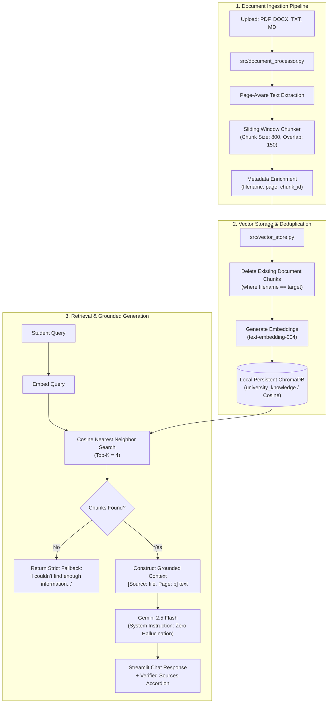

# System Architecture: Intelligent University Knowledge Assistant

This technical architecture document explains the internal design, component relationships, data flow pipelines, and grounding mechanisms implemented in the University Knowledge Assistant.

---

## 1. High-Level Architecture Overview

The system is designed as a modular, local-first Retrieval-Augmented Generation (RAG) platform. It pairs a persistent local vector database ([ChromaDB](https://www.trychroma.com/)) with Google's state-of-the-art embedding (`text-embedding-004`) and reasoning (`gemini-1.5-flash`) foundation models.



---

## 2. Ingestion Engine Pipeline

The ingestion engine is encapsulated in `src/document_processor.py`. It is responsible for parsing heterogenous raw document formats into normalized text pages and then chunking the text into indexable units.

### 2.1 Extraction Strategy by Format
1. **Portable Document Format (`.pdf`)**:
   - Implemented using **PyMuPDF** (`pymupdf`/`fitz`).
   - Parses documents on a page-by-page basis.
   - Preserves natural 1-based page indexing (`page_number = page.number + 1`).
   - Ignores blank or whitespace-only pages to preserve vector space efficiency.
2. **Word Documents (`.docx`)**:
   - Implemented via `python-docx`.
   - Iterates through document paragraphs and normalizes line breaks.
   - Assigned to document page 1 (flow-based pagination).
3. **Plain Text (`.txt`) and Markdown (`.md`)**:
   - Streamed using UTF-8 encoding with character replacement fallbacks for corrupted byte sequences.

### 2.2 Text Chunking Strategy
- **Sliding Window Chunking**:
  - `chunk_size = 800` characters: Captures sufficient semantic context for complex policies (curfews, grading rules, exam penalties).
  - `overlap = 150` characters: Prevents loss of context across chunk boundaries, ensuring queries spanning sentence transitions are retrieved intact.
  - Step size: `step = chunk_size - overlap = 650` characters.
- **Deterministic Chunk ID Generation**:
  - Format: `{filename}_p{page}_c{chunk_index}`
  - Example: `Academic_Regulations.txt_p1_c0`
  - Facilitates 1:1 tracebacks from retrieved vectors to the exact file and page of origin.

---

## 3. Persistent Vector Store & Indexing Engine

The vector store layer is implemented in `src/vector_store.py` using **ChromaDB**.

### 3.1 Persistent Storage Specification
- **Storage Location**: Local directory `data/chroma_db/`.
- **Collection Name**: `university_knowledge`.
- **Distance Metric**: Cosine Distance (`metadata={"hnsw:space": "cosine"}`).

$$\text{Cosine Similarity} = \frac{\mathbf{A} \cdot \mathbf{B}}{\|\mathbf{A}\|_2 \|\mathbf{B}\|_2}$$

### 3.2 Deduplication and Document Update Mechanism
When updating a previously uploaded document, naive indexing leads to duplicate stale chunks. The `VectorStore.add_documents()` method addresses this:
1. Identifies unique filenames in the incoming chunk batch.
2. Executes a targeted purge on the collection:
   ```python
   collection.delete(where={"filename": filename})
   ```
3. Upserts the new chunks into the vector store.
4. Ensures clean idempotency without needing to wipe the entire database.

---

## 4. Citation and Anti-Hallucination Pipeline

The RAG pipeline is implemented in `src/rag_pipeline.py`.

### 4.1 Semantic Distance Threshold & Strict Retrieval Guardrail
Before any call to the Gemini API, candidate chunks from vector search are filtered by a cosine distance threshold:
- `valid_chunks = [c for c in retrieved_chunks if c.get("distance", 1.0) <= distance_threshold]` (default `distance_threshold = 0.65`).
- If no chunks survive the threshold (or if the collection is empty), the assistant short-circuits and immediately returns:
  > *"I couldn't find enough information about this in the uploaded university documents."*
- This prevents out-of-domain or irrelevant queries from passing loosely related text into the context, enforcing an objective mathematical boundary against hallucinations.

### 4.2 Context Formatting
When chunks are retrieved, they are assembled into a structured context string:
```text
[Source: Academic_Regulations.txt, Page: 1] Attendance between 65% and 74% may apply for condonation...

[Source: Examination_Rules.txt, Page: 1] Candidates must report to their assigned examination hall...
```

### 4.3 Zero-Hallucination System Instruction
The model is prompted with a strict role definition:
```text
You are the Intelligent University Knowledge Assistant. Answer the question using ONLY the provided document context.
If the answer is not present in the context, respond exactly:
'I couldn't find enough information about this in the uploaded university documents.'
Never speculate, extrapolate, or invent regulations, dates, fees, or policies.
Cite the exact document and page number in your answer.
```
- Temperature is set to `0.0` for deterministic outputs.
- Model selected: `gemini-1.5-flash` for high-speed, cost-effective inference.

---

## 5. User Interface Architecture

The web interface is built using **Streamlit** (`app.py`), structured into two synchronized zones:
1. **Administrative Sidebar**:
   - Live Gemini API connection status badge.
   - Dynamic file uploader supporting drag-and-drop.
   - Chunk size and overlap tuning parameters.
   - Real-time document inventory showing chunk counts per file.
   - Per-document deletion buttons and full database reset.
   - One-click sample document indexer.
2. **Interactive Main Chat Area**:
   - Chat history with user and assistant turns.
   - Click-to-ask demonstration query buttons.
   - Collapsible citation cards showing the source filename, page, and text snippet.
